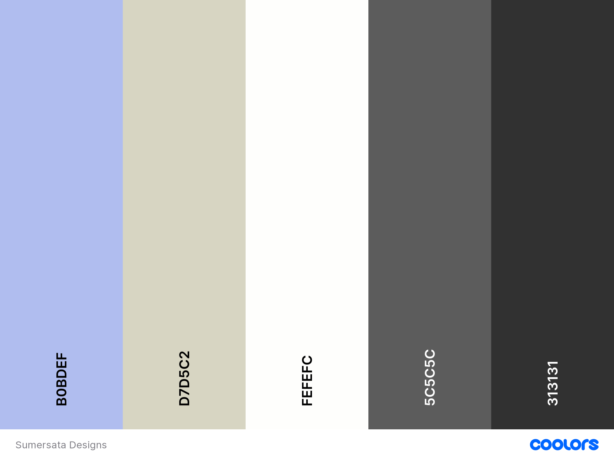

# Sumersata Designs

Sumersata Designs is a craft-design business situated in the South West of England, offering unique crafted products and courses teaching people how to craft like them.

The primary goal of this website is to provide an informative and easy-to-use platform for the user to explore products and coursesm offered by Sumersata Designs, as well as offer the ability for the user to contact the business for craft-design requests.

Visit the deployed site here.

---

# User Experience (UX)

## Project Goals

* The website can be easily navigated and understood.
* Explains who Sumersata Designs are and what they have to offer.
* Contains clear imagery and content.
* Clearly outlines where to purchase products and courses offered.
* Shows a vibrant image gallery of craft designs.
* Provides a simple contact form.

## User Stories

* As a user, I want to be able to navigate the website easily.
* As a user, I want to know who Sumersata Designs are.
* As a user, I want to know how and where to purchase products and courses.
* As a user, I want to see a selection of previous/current designs.
* As a user, I want to be able to contact Sumersata Designs easily.

## Colour Scheme

The colours used for this website are:

* Lavender (#b0bdef) - for the header, footer and contact form
* Beige (#d7d5c2) - for the background of the 'Reviews' section
* Off-white (#fefefc) - for the navbar toggler, nav underlines, social links icons and main background color for each page and all cards
* Light Grey (#5c5c5c) - for the social links, the background colour for the 'Address & Contact' section on the home page, the outline for the input fields of the contact form and the hover effect for the form submit button
* Charcoal (#313131) - for the bulk of the text including the nav title, card text and contact form text, and the nav link underlines

## Typography

The main font used throughout the site is Roboto Condensed, with sans-serif as a fallback if it fails to load. This font was suggested on [figma.com](https://www.figma.com/google-fonts/roboto-font-pairings/#:~:text=Roboto%20font%20pairings,Nunito%2C%20Raleway%20and%20Space%20Mono.) as a good font pairing with Lora, which is used for all headings and the nav title. Serif is used as a fall-back for Lora.

## Wireframes

[Figma](https://www.figma.com/) was used to showcase the visuals of each of the three pages of the site and where each of the elements within each page sit.

The [full version of wireframes](https://www.figma.com/file/OYkMASdYDDyC3K3OuCFwXX/Sumersata-Designs?type=design&node-id=3-210&mode=design&t=o6YosKl7NdoBeGkW-0) can be viewed to see the layout of all three pages across the three main screen sizes.

Page | Wireframe
--- | ---
Home section | 
Gallery section | 
Contact Us section| 

# Features

## General

* The website was designed from a mobile-first perspective.
* The website is responsive on all screen sizes, including very small screens such as the Galaxy Fold.

### Header

The header consists of:

* The business logo in the top left - this is a clickable link that takes the user to the home page.
* The business name/title and their slogan - this is also a clickable link that takes the user to the home page.
* Navigation links for all three pages of the website - each link has a dark grey underline when hovered over and an off-white underline for the active page.

On medium and small screen sizes, the navigation links turn into a Navbar Toggler which expands and collapses when clicked on.

When expanded, the nav links are displayed vertically with the same underline and 'active' features as the large screen size header.

On very small screen widths - 333px or less - the logo gets hidden otherwise there's not enough room for all the features of the header.

### Footer

The footer consists of:

* Copyright information on the left.
* Social links on the right - these are clickable links that go to their respective social pages:
  * Etsy
  * Facebook
  * Instagram
  * Twitter
  * Youtube

On medium and small screen sizes, the social links and copyright information stack on top of each other. This seems more visually appealing and stops the footer becoming cramped.

## Home Page

* The content of all sections of the home page stays the same - only layout and sizing changes.

### About Us

The About section consists of:

* An image of the business owners.
* Text explaining the 'who' and 'what' of the business.

### Shops/Courses/Events

This section consists of three cards describing and taking the user to the following:

* Shop - the [Sumersata Designs Etsy](https://www.etsy.com/shop/SumersataDesigns) store where the user can browse or purchase pre-made designs.
* Courses - the [CraftCourses.com](https://www.craftcourses.com/craft-workshops?keyword=sumersata) website where the user can browse or purchase crafting courses that Sumersata Designs offer.
* Events - the [Sumersata Designs Facebook](https://www.facebook.com/SumersataDesigns) page where the user can see any upcoming events for the business.

These are all clickable links and there's a hover effect for each card to accentuate this.

### Reviews/Testimonies

The Reviews section consists of:

* The top rated reviews left by customers who've experienced courses offered by Sumersata Designs.
* An annotated image of a customer whom attended a course and left a review.
* A Silver Certificate of Excellence awarded to Sumersata Designs by CraftCourses.com.

### Address/Map

This section consists of:

* The business address and contact email address.
* An interactive Google Map pinned to the business address.

## Gallery Page

This section consists of images of a selection of designs by Sumersata Designs. The gallery has been styled on the 'Masonry' layout, although altered to ensure there's no dead space at the bottom of the page.

The layout of the gallery columns and sizing changes depending on screen size (pictured below), but the content stays the same.

* On screens wider than 1024px, all gallery images are reduced in opacity, with an effect that reveals each image when you hover over them.

Screen Size | Gallery
--- | ---
Desktop | 
Tablet | 
Phone | 

## Contact-Us Page

* The content of all sections of the home page stays the same - only layout and sizing changes.

This section consists of:

* A full screen background image in the form of a wrapper around Header, Main section and Footer.
* A contact form containing the following inputs:
  * Name
  * Email
  * Textarea - where users can request a design idea
  * Checkbox - where users can sign up to the weekly newsletter
  * Submit button

On larger screen sizes, the form is positioned to the left of the screen in order to show more of the background image. This also helps the form remain a sensible width and remain visually appealing.

On smaller screen sizes, the width of the form covers around 80% of the width of the screen and is positioned centrally.

# Technologies Used

## Languages Used

* [HTML](https://en.wikipedia.org/wiki/HTML)
* [CSS](https://en.wikipedia.org/wiki/CSS)

## Frameworks, Libraries and Programs Used

* [Google Fonts](https://fonts.google.com/)
  * Google fonts was used to import Lora and Roboto Condensed into the head of each page. These fonts are used throughout the website.

* [Font Awesome](https://fontawesome.com/)
  * Font Awesome was used to add icons for the social links and stars for the reviews section, to add a better user experience.

* [CodeAnywhere](https://app.codeanywhere.com/)
  * CodeAnywhere was used for writing, committing and pushing the code to GitHub.

* [Bootstrap](https://getbootstrap.com/)
  * Bootstrap was used to develop a responsive mobile-first design using an assortment of templates.

* [Chrome DevTools](https://developer.chrome.com/docs/devtools/)
  * Chrome DevTools was used throughout the development of the website to test ideas and responsiveness, and debug issues that arose.

* [W3C Markup Validator](https://validator.w3.org/)
  * W3C Markup Validator was used to validate the HTML code.

* [W3C CSS Validator](https://jigsaw.w3.org/css-validator/)
  * W3C CSS Validator was used to validate the CSS code.

* [Favicon.io](https://favicon.io/)
  * Favicon.io was used to create the site favicon.

# Testing

## Testing User Stories

## Code Validation

* The [W3C Markup Validator](https://validator.w3.org/) and [W3C CSS Validator](https://jigsaw.w3.org/css-validator/) services were used to checl for any code errors or misuse of syntax/elements.

  * The W3C Markup Validator returned a few errors:

    * The use of an aria-label on a div element which containtd a background image. This was overcome by adding an "sr-only" Bootstrap class to a 'p' element which a description of the image.
    * The use of a div element inside a figure element. This was overcome by changing the element to a span and moving it inside the ficcaption element.
    * The use of a 'section' element without a heading. This was overcome by removing it altogether, as it didn't serve a purpose.
    * The form inputs and labels missing ID attributes which were added shortly after.

  * The W3C CSS Validator returned no errors in the code.

# Finished Product

# Deployment

# Credits

# Acknowledgements
