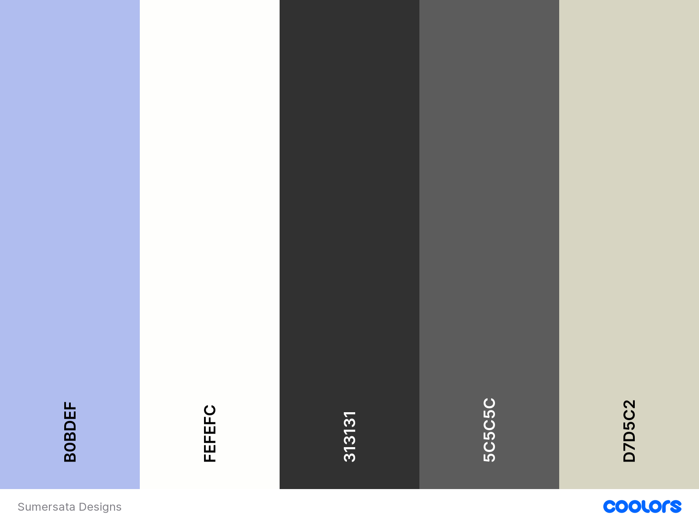

# Sumersata Designs

Sumersata Designs is a craft-design business situated in the South West of England, offering unique crafted products and courses teaching people how to craft like them. The business owners are relatives of the developer: Pauline (Mother) & Janet (Auntie).

The primary goal of this website is to provide an informative and easy-to-use platform for the user to explore products and courses offered by Sumersata Designs, as well as offer the ability for the user to contact the business for craft-design requests.

Visit the deployed site [here](https://danhodgson12.github.io/Sumersata-Designs/).

---

# Table Of Contents

- [Sumersata Designs](#sumersata-designs)
- [Table Of Contents](#table-of-contents)
- [User Experience (UX)](#user-experience-ux)
  - [Project Goals](#project-goals)
  - [User Stories](#user-stories)
  - [Colour Scheme](#colour-scheme)
  - [Typography](#typography)
  - [Wireframes](#wireframes)
- [Features](#features)
  - [General](#general)
    - [Header](#header)
    - [Footer](#footer)
  - [Home Page](#home-page)
    - [About Us](#about-us)
    - [Shops/Courses/Events](#shopscoursesevents)
    - [Reviews/Testimonies](#reviewstestimonies)
    - [Address/Map](#addressmap)
  - [Gallery Page](#gallery-page)
  - [Contact-Us Page](#contact-us-page)
  - [404 Error Page](#404-error-page)
- [Technologies Used](#technologies-used)
  - [Languages](#languages)
  - [Frameworks, Libraries \& Programs](#frameworks-libraries--programs)
- [Testing](#testing)
  - [Testing User Stories](#testing-user-stories)
  - [Code Validation](#code-validation)
  - [Lighthouse Report](#lighthouse-report)
    - [Home Page](#home-page-1)
    - [Gallery Page](#gallery-page-1)
    - [Contact Us Page](#contact-us-page-1)
  - [Tools Testing](#tools-testing)
  - [Manual Testing](#manual-testing)
    - [Browser Compatibility](#browser-compatibility)
    - [Device compatibility](#device-compatibility)
    - [Common Elements Testing](#common-elements-testing)
      - [General](#general-1)
      - [Home Page](#home-page-2)
      - [Gallery](#gallery)
      - [Contact Us Page](#contact-us-page-2)
      - [404 Error Page](#404-error-page-1)
- [Finished Product](#finished-product)
- [Deployment](#deployment)
  - [GitHub Pages](#github-pages)
  - [Making a Local Clone](#making-a-local-clone)
- [Credits](#credits)
  - [Content](#content)
  - [Media](#media)
  - [Code](#code)
- [Acknowledgements](#acknowledgements)

# User Experience (UX)

## Project Goals

- The website can be easily navigated and understood.
- Explains who Sumersata Designs are and what they have to offer.
- Contains clear imagery and content.
- Clearly outlines where to purchase products and courses offered.
- Shows a vibrant image gallery of craft designs.
- Provides a simple contact form.

## User Stories

- As a user, I want to be able to navigate the website easily.
- As a user, I want to know who Sumersata Designs are.
- As a user, I want to know how and where to purchase products and courses.
- As a user, I want to be able to visit Sumersata Designs' social media websites.
- As a user, I want to see a selection of previous/current designs.
- As a user, I want to be able to contact Sumersata Designs easily.
- As a user, I want to be able to view the website on a variety of screen sizes.
- As a user, I want to be able to get back to the Home page if I lose my way.

[Go to 'Features' section](#features)

## Colour Scheme

The colours used for this website are:

- Lavender (#b0bdef) - for the header, footer and contact form
- Off-white (#fefefc) - for the navbar toggler, nav underlines, social-links icons and main background colour for each page and all cards
- Charcoal (#313131) - for the bulk of the text including the nav title, card text and contact form text, and the nav link underlines
- Light Grey (#5c5c5c) - for the social links, the background colour for the 'Address & Contact' section on the home page, the outline for the input fields of the contact form and the hover effect for the form's submit button
- Beige (#d7d5c2) - for the background of the 'Reviews' section

## Typography

The main font used throughout the site is Roboto Condensed, with sans-serif as a fallback if it fails to load. This font was suggested on [figma.com](https://www.figma.com/google-fonts/roboto-font-pairings/#:~:text=Roboto%20font%20pairings,Nunito%2C%20Raleway%20and%20Space%20Mono.) as a good font pairing with Lora, which is used for all headings and the nav title. Serif is used as a fall-back for Lora.

## Wireframes

[Figma](https://www.figma.com/) was used to showcase the visuals of each of the three pages of the site and where each of the elements within each page sit.

The [full version of wireframes](https://www.figma.com/file/OYkMASdYDDyC3K3OuCFwXX/Sumersata-Designs?type=design&node-id=3-210&mode=design&t=o6YosKl7NdoBeGkW-0) can be viewed to see the layout of all three pages across the three main screen sizes.

Page | Wireframe
--- | ---
Home section | 
Gallery section | 
Contact Us section| 

[Back to top &#8682;](#table-of-contents)

# Features

## General

- The website was designed from a mobile-first perspective.
- The website is responsive on all screen sizes, including very small screens such as the Galaxy Fold.
    - This allows the user to [view the website on a variety of screen sizes](#user-stories).

### Header

The header consists of:

- The business logo in the top left - this is a clickable link that takes the user to the home page
- The business name/title and their slogan - this is also a clickable link that takes the user to the home page
- Navigation links for all three pages of the website - each link has a dark grey underline when hovered over and an off-white underline for the active page
    - This let's the user [navigate the website easily](#user-stories)

The header sticks to the top of the page when scrolling and is used on all pages of the website.

On medium and small screen sizes, the navigation links turn into a **Navbar Toggler** which expands and collapses when clicked.

When expanded, the nav links are displayed vertically with the same underline and 'active' features as the large screen size header.

On very small screen widths - 333px or less - the logo gets hidden otherwise there's not enough room for all the features of the header.

### Footer

The footer consists of:

- Copyright information on the left.
- Social links on the right - these are clickable links that go to their respective social pages:
  - Etsy
  - Facebook
  - Instagram
  - Twitter
  - Youtube

This section of the footer [allows the user to visit Sumersata Designs' social media websites](#user-stories).

The footer sticks to the bottom of the page when scrolling and is used on all pages of the website.

On medium and small screen sizes, the social links and copyright information stack on top of each other. This seems more visually appealing and stops the footer becoming cramped.

## Home Page

The content of all sections of the Home page stays the same - only layout and sizing changes.

### About Us

The About section consists of:

- An image of the business owners
- Text explaining the 'who' and 'what' of the business
    - This lets the [user know who Sumersata Designs are](#user-stories)

### Shops/Courses/Events

This section consists of three cards describing and taking the user to the following:

- Shop - the [Sumersata Designs Etsy](https://www.etsy.com/shop/SumersataDesigns) store where the user can browse or purchase pre-made designs
- Courses - the [CraftCourses.com](https://www.craftcourses.com/craft-workshops?keyword=sumersata) website where the user can browse or purchase crafting courses that Sumersata Designs offer
- Events - the [Sumersata Designs Facebook](https://www.facebook.com/SumersataDesigns) page where the user can see any upcoming events for the business

This section lets the user [know how and where to purchase products and courses](#user-stories).

These are all clickable links and there's a hover effect for each card to accentuate this.

### Reviews/Testimonies

The Reviews section consists of:

- The top rated reviews left by customers who've experienced courses offered by Sumersata Designs
- An annotated image of a customer whom attended a course and left a review
- A Silver Certificate of Excellence awarded to Sumersata Designs by CraftCourses.com

### Address/Map

This section consists of:

- The business address and contact email address
- An interactive Google Map pinned to the business address

## Gallery Page

This section consists of images of a selection of designs by Sumersata Designs. This allows the user to [see a selection of previous/current designs](#user-stories).

The gallery has been styled on the 'Masonry' layout, although altered to ensure there's no dead space at the bottom of the page. The layout of the gallery columns and sizing changes depending on screen size (pictured below), but the content stays the same.

- On screens wider than 1400px, all gallery images are reduced in opacity, with an effect that reveals each image when you hover over it.

Screen Size | Gallery
--- | ---
Desktop | 
Tablet | 
Phone | 

## Contact-Us Page

This section consists of:

- A full screen background image in the form of a wrapper around the Header, Main section and Footer
- A contact form containing the following inputs:
  - Name
  - Email
  - Text-area - where users can request a design idea
  - Checkbox - where users can sign up to the weekly newsletter
  - Submit button

This section allows the user to contact [Sumersata Designs easily](#user-stories).

On larger screen sizes, the form is positioned to the left of the screen in order to show more of the background image. This also helps the form remain a sensible width and remain visually appealing.

On smaller screen sizes, the width of the form covers around 80% of the width of the screen and is positioned centrally.

The content of the Contact Us page stays the same - only layout and sizing changes.

## 404 Error Page

This page shows when the user enters an incorrect version of the website's URL.
- This helps the user [find their way back to the home page if they lose their way](#user-stories).

The page consists of:

- A '404 error' title
- An amusing image to keep the page lighthearted
- A message explaining how the user got to this page
- Text explaining how to get back to the home page
- A clickable button taking the user back to the home page
  - This button has the same styling as the button on the contact form to keep the theme consistent

[Back to top &#8682;](#table-of-contents)

# Technologies Used

## Languages

- [HTML](https://en.wikipedia.org/wiki/HTML)
- [CSS](https://en.wikipedia.org/wiki/CSS)

## Frameworks, Libraries & Programs

- [Google Fonts](https://fonts.google.com/)
  - Google fonts was used to import Lora and Roboto Condensed into the head of each page. These fonts are used throughout the website.

- [Font Awesome](https://fontawesome.com/)
  - Font Awesome was used to add icons for the social links and stars for the reviews section, to add a better user experience.

- [CodeAnywhere](https://app.codeanywhere.com/)
  - CodeAnywhere was used for writing, committing and pushing the code to GitHub.

- [Bootstrap 5](https://getbootstrap.com/)
  - Bootstrap 5 was used to develop a responsive mobile-first design using an assortment of templates.

- [Chrome DevTools](https://developer.chrome.com/docs/devtools/)
  - Chrome DevTools was used throughout the development of the website to test ideas and responsiveness, and debug issues that arose.

- [W3C Markup Validator](https://validator.w3.org/)
  - W3C Markup Validator was used to validate the HTML code.

- [W3C CSS Validator](https://jigsaw.w3.org/css-validator/)
  - W3C CSS Validator was used to validate the CSS code.

- [Favicon.io](https://favicon.io/)
  - Favicon.io was used to create the site favicon.

[Back to top &#8682;](#table-of-contents)

# Testing

## Testing User Stories

- As a user, I want to be able to navigate the website easily.
  - Navigation links have been placed at the top-right of the page for easy navigation across each page.
  - A white underline on the navigation link indicates which page the user is currently on.
  - Darker underlines appear when the user hovers over each link.
  - The Header's Logo is clickable and takes the user back to the home page, as is [standard practice](https://www.nngroup.com/articles/homepage-links/) with modern websites.

- As a user, I want to know who Sumersata Designs are.
  - An About section explains to the user who the business owners are and what they have to offer.
  - A image of the business owners lets the user see who they are.

- As a user, I want to know how and where to purchase products and courses.
  - The Etsy 'shop card' let's the user visit the Sumersata Designs Etsy storefront and browse products.
  - The Courses 'shop card' let's the user visit the Sumersata Designs CraftCourses.com storefront and browse courses taught by the business.
  - Each card is a clickable link.
  - Each card is accentuated by a shadow when the user hovers over it.
  - The reviews section provides the user with reassurance.

- As a user, I want to see a selection of previous/current designs.
  - The Gallery page displays a wide range of products designed by Sumersata Designs.

- As a user, I want to be able to contact Sumersata Designs easily.
  - The Contact Us page let's the user fill in their details to get in touch with Sumersata Designs.
  - The Home page also provides the user with a contact email.
  - The Home page contains an address for the business and an interactive map to find the business.
  
- As a user, I want to be able to view the website on a variety of screen sizes.
  - The website is responsive across all screen sizes.

## Code Validation

The [W3C Markup Validator](https://validator.w3.org/) and [W3C CSS Validator](https://jigsaw.w3.org/css-validator/) services were used to check for any code errors or misuse of syntax/elements.

The W3C Markup Validator returned a few errors:

- The use of an `aria-label` on a `div` element which contained a background image. 
    - This was overcome by adding an `sr-only` Bootstrap class to a `p` element with a description of the image.

- The use of a `span` element inside a `figure` element. 
    - This was overcome by moving it inside the `figcaption` element.

    
- The use of a `section` element without a heading. 
    - This was overcome by removing it altogether, as it didn't serve a purpose.

- The form `inputs` and `labels` missing `ID` attributes.
    - `ID` attributes were added shortly after to fix this issue.

- The W3C CSS Validator returned no errors in the code.

## Lighthouse Report

Lighthouse in Google Chrome Dev Tools was used to test performance, accessibility, best practices and search engine optimisation of the webpage.

### Home Page

- Performance was somewhat hindered by an error message stating that the images didn't have efficient cache policies - performance was different on each lighthouse report despite no changes made.
- Suggestions were made to reduce file size. Decided not to as the images on this page were already at the smallest file size and pixel width/height they could be before image distortion.
  

### Gallery Page

### Contact Us Page

## Tools Testing

- [Google Chrome DevTools](https://developer.chrome.com/docs/devtools/)
  - Google Chrome DevTools was used throughout the development process to test, explore and make changes to the HTML and CSS of the webpage.

- Responsiveness
  - [Responsive Design Checker](https://www.responsivedesignchecker.com/) was used to check responsiveness across a variety of devices and screen sizes.
  - [Am I Responsive?](https://ui.dev/amiresponsive) was used to check responsiveness across different screen sizes and generate the mockup final image.
  - [Google Chrome DevTools](https://developer.chrome.com/docs/devtools/) was used to check responsiveness across different screen sizes during the development and testing phases.

## Manual Testing

### Browser Compatibility

Browser | Outcome | Pass/Fail
--- | --- | ---
Google Chrome | No appearance, responsiveness or functionality issues | Pass
Safari | No appearance, responsiveness or functionality issues | Pass
Mozilla Firefox | No appearance, responsiveness or functionality issues | Pass
Microsoft Edge | No appearance, responsiveness or functionality issues | Pass
  
### Device compatibility

- The website was tested across a wide variety of devices using [Google Chrome DevTools](https://developer.chrome.com/docs/devtools/) & [Responsive Design Checker](https://www.responsivedesignchecker.com/) - no appearance, responsiveness or functionality issues were found.

### Common Elements Testing

#### General
  
Feature | Outcome | Pass/Fail
--- | --- | ---
  NavBar Logo | Takes user back to home page as expected | Pass
  NavBar Title | Takes user back to home page as expected | Pass
  Nav Links | Each link takes user to relevant page | Pass
  Nav Link Hover | Shows underline when hovering over links as expected | Pass
  Nav Link Active | Shows underline on active page as expected | Pass
  Nav Toggler | Collapses and expands with no visible issues | Pass
  Social Links | Each link opens in a new page | Pass
  Social Links Hover | Each link's hover effect works without issue | Pass

#### Home Page

Feature | Outcome | Pass/Fail
--- | --- | ---
Shop Cards | Each link opens in a new tab | Pass
Shop Card Hover | Each card has a border shadow when hovered over as expected | Pass
Review Figcaptions | Each link opens to the relevant review source | Pass
Google Map | Interactive map functions as expected | Pass

#### Gallery

Feature | Outcome | Pass/Fail
--- | --- | ---
Gallery Images | Number of columns change at breakpoint as expected | Pass
Gallery Image Hover | Hover effect only appears at extra large breakpoint as expected | Pass

#### Contact Us Page

Feature | Outcome | Pass/Fail
--- | --- | ---
Form Inputs | Name and Email inputs required to submit form | Pass
Form Inputs cont. | Design Idea field optional, can be expanded, minimum height effective | Pass
Submit Button | Hover effect works as expected and submits form | Pass

#### 404 Error Page

Feature | Outcome | Pass/Fail
--- | --- | ---
404 Error Page | Page appears when user enters incorrect URL | Pass
Home Button | User is taken to home page as expected | Pass

[Back to top &#8682;](#table-of-contents)

# Finished Product

Page | Image
--- | ---
Home Page |  Note: The interactive google map did not show in the full screenshot.
Gallery | 
Contact Us | 
404 Error Page | 

[Back to top &#8682;](#table-of-contents)

# Deployment

This website was developed using [Codeanywhere](https://codeanywhere.com/solutions/collaborate), then committed and pushed to GitHub using the Codeanywhere terminal.

## GitHub Pages

The project was deployed to GitHub Pages using the following steps:

1. Log into GitHub and locate the [GitHub Repository](https://github.com/DanHodgson12/Sumersata-Designs)
2. At the top of the page, locate the "Settings" button on the menu bar
   
3. Under "Code and automation" on the left hand side of the window, click the "Pages" tab
   
4. Under "Source", select the option "Deploy from a branch"
5. Under "Branch", select the option "main", then select the "/(root)" folder
6. Click "Save" and the page will refresh
7. The published site link appears at the top of the "GitHub Pages" section
8. Click "Visit Site" and the website will open

## Making a Local Clone

To make a clone of this project, please use the following steps:

1. Log into GitHub and locate the [GitHub Repository](https://github.com/DanHodgson12/Sumersata-Designs)
2. At the top of the Repository (not top of page), locate and click on the "< > Code" button on the menu bar
3. In the "Local" tab, beneath where it says "Clone", select the "HTTPS" option
4. Just below that, copy the link for the repository
5. Open Git Bash
6. Change the current working directory to the location where you want the cloned directory to be made
7. Type `git clone`, and then paste the URL you copied in Step 3
8. Press Enter. Your local clone will be created

# Credits

## Content

- All content was written by the developer.

## Media

- Sumersata Designs provided the 'Logo', the 'About' image, 'Customer' image, 'Certificate' image, 'Market' image and Gallery images.
- The reviews are real reviews taken from Sumersata Designs' [CraftCourses.com](https://www.craftcourses.com/in-person-and-online-courses-craft-kits-and-handcrafted-gifts?keyword=sumersata&location=Somerset) page.
- The [full screen background image](/assets/images/contact/sd-contact-bg.jpg) for the 'Contact Us' page was taken from [Pexels](https://www.pexels.com/photo/person-doing-calligraphy-6232452/) and was created by [Anastasia Shuraeva](https://www.pexels.com/@anastasia-shuraeva/).
- The 'ETSY' and 'CraftCourses.com' logos were sampled from their respective websites then adjusted for use in this project.

## Code

- [Bootstrap 5](https://getbootstrap.com/docs/5.3/getting-started/introduction/) was used throughout to help with responsiveness and styling purposes.
- [Font Awesome](https://fontawesome.com/) was used for adding the social-link icons and review star icons.
- [W3Schools](https://www.w3schools.com/) & [Stack Overflow](https://stackoverflow.co/teams/) were utilised to help overcome roadblocks in the developer's coding knowledge.
- [Stack Overflow](https://stackoverflow.com/questions/2570972/css-font-border) was used for help giving the review stars a slight border in order to make them stand out.
- [Stack Overflow](https://stackoverflow.com/questions/4575826/how-to-push-a-footer-to-the-bottom-of-page-when-content-is-short-or-missing) was also used for help with an issue on the Contact Us page, where the background image was not pushing the footer to the bottom of the page.
- [CSS Scan](https://getcssscan.com/css-buttons-examples) was used for adding the base version of the button to the contact form (Button 24).

# Acknowledgements

- My family, for their valuable opinions and unconditional support.
- My mentor Marcel, for his encouraging feedback and patience during my learning journey.
- Code Institute, for its wonderful learning platform and supportive community.

[Back to top &#8682;](#table-of-contents)
